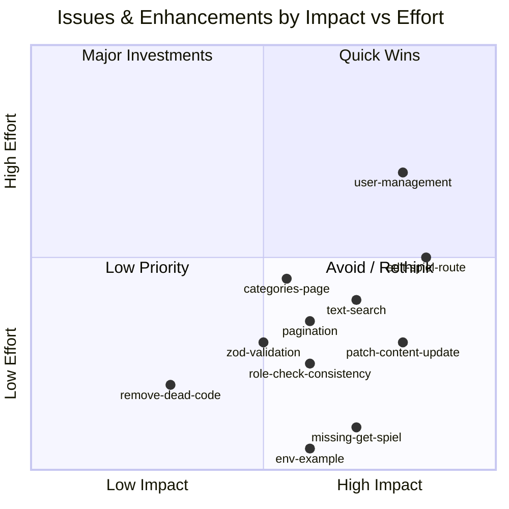

# RepFlow — Issues & Enhancement Opportunities

> **Date:** 2026-05-23
> **Companion to:** `01-codebase-research.md`
> **Focus:** Actionable bugs and growth opportunities

---

## Priority Matrix



---

## 🔴 Critical Issues (Fix Immediately)

### 1. Edit Route Links to 404

**File:** `app/(dashboard)/spiels/[id]/page.tsx`
**Line:** ~21

```tsx
<Link href={`/spiels/${params.id}/edit`}>
```

**Problem:** No `app/(dashboard)/spiels/[id]/edit/` page exists.

**Fix:** Create the route page + update the `PATCH` API to support content updates.

---

### 2. Spiel Detail Has No Data (No `GET` API)

**File:** `app/api/spiels/[id]/route.ts`

**Problem:** Only `PATCH` and `DELETE` are exported. The detail page at `/spiels/[id]` has no way to fetch data.

**Fix:** Add a `GET` handler that fetches the spiel with relations (department, category, creator).

---

### 3. No Content Update API

**File:** `app/api/spiels/[id]/route.ts` — `PATCH` handler

**Problem:** PATCH only archives:
```ts
const updated = await prisma.spiel.update({
  where: { id },
  data: { status: "archived" },
});
```

**Fix:** Accept optional fields (`title`, `contentHtml`, `contentJson`, `contentPlain`, `categoryId`) and dynamically build the update payload.

---

## 🟡 Medium Issues (Should Fix Soon)

### 4. No Pagination on Spiel Lists

**Files:**
- `app/(dashboard)/spiels/page.tsx`
- `app/(dashboard)/archive/page.tsx`

**Problem:** `prisma.spiel.findMany()` with no `take`/`skip` — will fetch all rows.

**Suggested pattern:**
```ts
const PAGE_SIZE = 50;
const spiels = await prisma.spiel.findMany({
  take: PAGE_SIZE + 1, // +1 to detect next page
  skip: params.page ? (Number(params.page) - 1) * PAGE_SIZE : 0,
  // ... rest of query
});
```

---

### 5. Dead Service Layer Code

**Files:**
- `server/services/spiel.service.ts`
- `server/services/user.service.ts`

**Problem:** These functions (`getSpielsByDepartment`, `getUserById`, `getUsersByCompany`, etc.) are not imported anywhere. Actual data access is written inline in route handlers.

**Fix:** Either:
- (a) Delete the files if the inline approach is intentional
- (b) Refactor route handlers to use the service layer

---

### 6. Missing `.env.example`

**Problem:** README references `.env.example` but it doesn't exist.

**Required vars (from code scan):**
```
DATABASE_URL=postgresql://...
BETTER_AUTH_SECRET=your-secret-here
BETTER_AUTH_URL=http://localhost:3000
NEXT_PUBLIC_APP_URL=http://localhost:3000
SEED_ADMIN_EMAIL=admin@example.com
SEED_ADMIN_PASSWORD=secure-password
```

---

### 7. No Search-by-Text

**Files:** `app/(dashboard)/spiels/page.tsx`

**Problem:** The library only filters by department/category. The PRD requires search by title and content text.

**Fix:** Add a search query parameter and use `Prisma.where` with `contains` mode:
```ts
where: {
  ...(search ? {
    OR: [
      { title: { contains: search, mode: 'insensitive' } },
      { contentPlain: { contains: search, mode: 'insensitive' } },
    ]
  } : {}),
}
```

---

### 8. Inconsistent Role Enforcement on API Routes

**Files:**
- `app/api/spiels/[id]/route.ts` — PATCH doesn't check `canManageSpiels`
- `app/api/departments/route.ts` — POST checks `canManageDepartment` ✅
- `app/api/departments/[id]/route.ts` — PATCH/DELETE check `canManageDepartment` ✅
- `app/api/categories/route.ts` — POST doesn't check manage role
- `app/api/categories/[id]/route.ts` — PATCH/DELETE don't check manage role

**Fix:** Add consistent role checks across all mutation endpoints.

---

### 9. Categories & Users Pages Are Empty

**Files:**
- `app/(dashboard)/categories/page.tsx` — Static placeholder
- `app/(dashboard)/users/page.tsx` — Static placeholder
- `app/(dashboard)/companies/page.tsx` — Static placeholder

**Problem:** These routes exist in the sidebar but show "No data yet" or "Coming soon."

---

## 🟢 Minor Issues

### 10. Unused Dependency — `framer-motion`
`package.json` includes `framer-motion` but no file imports it.

### 11. `postcss` in dependencies twice
Listed in both `dependencies` and `devDependencies` in `package.json`.

### 12. No Input Sanitization on Rich Text
Spiel `contentHtml` is stored as-is from the editor and rendered back to users. If an admin pastes malicious HTML, it will be rendered to other users.

---

## 🚀 Enhancement Opportunities (Growth)

### Feature Gaps (Phase 1.1 candidates)

| Feature | Current State | Value |
|---|---|---|
| **Edit spiel** | No route exists | Core CRUD completion |
| **User management** | Placeholder page | Admin empowerment |
| **Text search** | Only filters | PRD requirement |
| **Category management page** | Placeholder page | Consistent UX |
| **Favorite/pin spiels** | Not started | Employee daily use |
| **Recent spiels** | Not started | Faster retrieval |
| **Activity logs UI** | Schema exists, no UI | Audit trail |
| **Company settings** | Placeholder page | Tenant management |

### Architecture Maturity

| Area | Current | Target |
|---|---|---|
| **Validation** | Manual checks | Zod/Valibot schemas |
| **Testing** | None | Vitest + Playwright |
| **API documentation** | None | OpenAPI / tRPC? |
| **Error boundaries** | None | Per-route error.tsx |
| **Loading skeletons** | Minimal | Every data-dependent view |
| **Pagination** | None | All list views |
| **Type safety** | Good (`strict: true`) | Generated types from DB/schema |
| **CI/CD** | None | GitHub Actions |

### Suggested Architecture Evolution

```
Current: Pages inline DB queries → Prisma
Target:  Pages → Service Layer (validated) → Prisma

Current: Manual validation in routes
Target:  Zod schemas shared between client + server

Current: proxy.ts (inactive)
Target:  middleware.ts (active) → Better Auth session check
```

---

## ⚡ Quick Wins (Sorted by Effort)

| # | Task | Est. Effort | Impact |
|---|---|---|---|
| 1 | Create `.env.example` | 5 min | 🟢 Developer onboarding |
| 2 | Add `GET /api/spiels/[id]` | 15 min | 🟡 Unblocks detail page |
| 3 | Add text search to spiel library | 30 min | 🟢 PRD requirement |
| 4 | Fix `spiels/[id]` edit link | 5 min | 🟢 Remove broken link |
| 5 | Remove unused dependencies | 10 min | 🟢 Housekeeping |

---

## 🏗️ Major Builds (Sprint-Worthy)

| # | Feature | Effort | Dependencies |
|---|---|---|---|
| 1 | Edit spiel page (full route) | 3-5 hrs | `GET /api/spiels/[id]`, extended `PATCH` |
| 2 | Categories management page | 2-3 hrs | Existing API |
| 3 | User management page | 4-6 hrs | New API routes, invite flow |
| 4 | Pagination on all lists | 2-3 hrs | URL search params refactor |
| 5 | Browser extension | 2-3 sprints | New codebase entirely |

---

## 📋 Code Health Metrics

| Metric | Current | Health |
|---|---|---|
| `.ts`/`.tsx` files | ~45 files | ✅ |
| `any` usage | Very low (mostly typed) | ✅ |
| `strict: true` | On | ✅ |
| Test coverage | 0% | ❌ |
| Dead code | `server/services/*.ts`, `framer-motion` | ⚠️ |
| ESLint errors | Unknown (not checked) | ⚠️ |
| Middleware | `proxy.ts` (Next.js 16 convention) | ✅ |
| Type casts | `as unknown as X` pattern used several times | ⚠️ |
| Client/Server boundaries | Clear for most part | ✅ |
